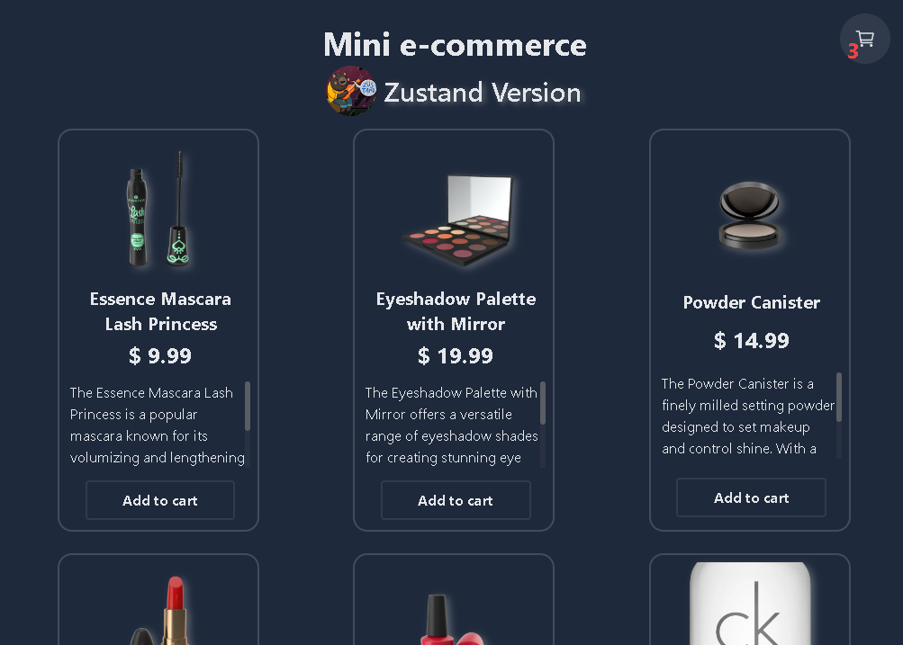
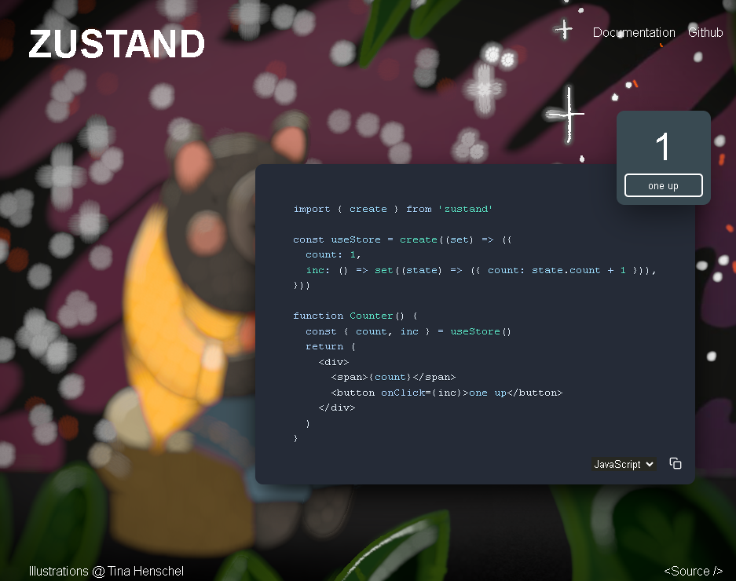

# State Managements (series) - Zustand



## Deploy

[Online demo - (soon)](#)

---

## Applied technologies (Stack)

### This app was created with this tecnologies: [`React.js`](https://react.dev/) with [`TypeScript`](https://www.typescriptlang.org/). Styles from [`Tailwind CSS`](https://tailwindcss.com/) and Icons from [`React Icons`](https://react-icons.github.io/react-icons/). <br/>

<div style="display: flex; flex-wrap: wrap; justify-content: center; align-items: center; gap: 1.5rem">


</div>

### This app corresponds to a series of intensive tests for the use of state managers. This is a case study, I used the following library for global state management:

<div style="text-align:center">

## [ZUSTAND](https://github.com/pmndrs/zustand)

</div>



## Getting Started (modify)

Elementary use:

### First create a store

```javascript
import { create } from "zustand";

const useBearStore = create((set) => ({
  bears: 0,
  increasePopulation: () => set((state) => ({ bears: state.bears + 1 })),
  removeAllBears: () => set({ bears: 0 }),
}));
```

### Then bind your components, and that's it!

```javascript
function BearCounter() {
  const bears = useBearStore((state) => state.bears);
  return <h1>{bears} around here ...</h1>;
}

function Controls() {
  const increasePopulation = useBearStore((state) => state.increasePopulation);
  return <button onClick={increasePopulation}>one up</button>;
}
```

## Learn More

To learn more about the developer:

- [Sergio Ortega dev](https://sergioortega.com.ar)
- [Sergio Ortega's portfolio](https://sergioortega.com.ar/#/portfolio) - an interactive portfolio.

---
